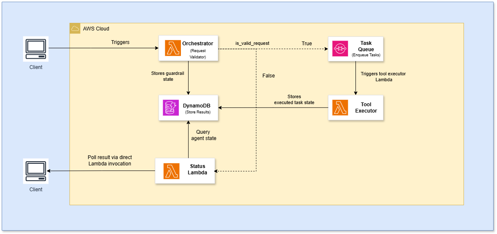

# AI-Driven-Feedback-Processor

Automates customer feedback analysis using AI based on user-defined instructions.

System Overview

The system consists of two primary agents:

1. **Orchestrator Agent** – Acts as a guardrail to validate and manage the feedback
   processing workflow.
2. **Tool Executor Agent** – Executes specialized tools as required.

The architecture is designed for **scalability, flexibility, and efficiency** in processing feedback while maintaining clear separation of concerns.

System Architecture:


## **Architectural Components:**

1. **AWS Lambda**
    - **Orchestrator Agent, Tool Executor and Status Handler**: Hosts the business logic for processing user instructions and executing domain-specific tools.
    - **Stateless Execution**: Each invocation is independent, ensuring scalability and fault isolation.
    - **Event-Driven Processing:** Automatically triggered by SQS, API Gateway, or direct invocation.
2. **Amazon DynamoDB**
    - **Guardrail State**: Stores safety rules, evaluation results (**`is_safe`**), and user instruction metadata.
    - **Tool Outputs**: Persists intermediate and final results from the Tool Executor for auditability and status tracking.
    - **Low-Latency Reads/Writes:** Single-digit millisecond response times for high-throughput workloads.
    - **Serverless Scaling:** Automatically scales capacity based on traffic.
3. **Amazon SQS (Simple Queue Service)**
    - **Decoupling**: Separates the Orchestrator Agent from downstream processors (Tool Executor/Response Handler).
    - **Task Buffering**: Queues validated instructions for asynchronous processing.

**Tools Used**

1. Sentiment Analysis Tool    
    Evaluates the emotional tone of text using NLP techniques to determine sentiment polarity (positive, negative, or neutral).
    
2. Topic Categorization Tool    
    Automatically organizes feedback into predefined categories such as Product Quality, Support, and others.
    
3. Keyword Contextualization Tool    
    Extracts significant terms from text and assigns relevance scores based on domain-specific context.
    
4. Summarization Tool    
    Produces clear and concise summaries, highlighting key insights and actionable recommendations.

## API Usage

### Sample Request

```json
{
  "feedback_id": "67890",
  "customer_name": "Jane Smith",
  "feedback_text": "The customer service was very helpful, but the website checkout process was confusing.",
  "timestamp": "2025-02-15T14:45:00Z",
  "instructions": "Analyze sentiment and suggest improvements for the checkout process."
}
```

### Sample Response

```json
{
  "metadata": {
    "feedback_id": "67890",
    "timestamp": "2025-02-15T14:47:32Z",
    "status": "completed",
    "execution_time_ms": 1245
  },
  "analysis": {
    "executed_tools": [
      "sentiment_analysis",
      "summarization"
    ],
    "results": {
      "sentiment_analysis": {
        "sentiment": "neutral"
      },
      "summarization": {
        "summary": "Customer praised support but experienced checkout confusion",
        "actionable_recommendations": [
          {
            "priority": "high",
            "action": "Add visual progress indicator during checkout steps",
            "impact": "Improves user orientation"
          }
        ]
      }
    }
  },
  "context": {
    "customer_name": "Jane Smith",
    "original_instructions": "Analyze sentiment and suggest improvements for the checkout process"
  }
}
```
